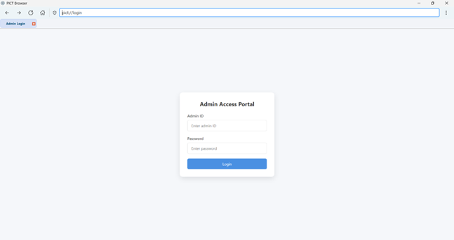

# Custom Browser for PICT - Setup Instructions
## About
This project implements a secure browser environment with website blocking capabilities. The browser allows administrators to maintain a blacklist of websites and domains that should be restricted. When users attempt to access a blacklisted website, the browser automatically blocks access to that site. This makes it ideal for institutional use where controlled internet access is required.
## Project Structure
- Frontend: PyQt5-based browser application
- Backend: Express.js/TypeScript server with Redis and MongoDB

## Backend Setup

1. Navigate to the backend directory:
```bash
cd Backend/custom-browser-server
```

2. Install dependencies:
```bash
npm install
```

3. Set up Prisma:
```bash
npx prisma generate
```

4. Start the backend server:
```bash
npm run dev
```

The backend server will start on port 3000.

## Frontend Setup

1. Navigate to the frontend directory:
```bash
cd frontend/pict-chromium-browser
```

2. Install Python dependencies:
```bash
pip install -r requirements.txt
```

Required packages:
- PyQt5
- websockets
- requests
- python-dotenv

3. Start the browser application:
```bash
python main.py
```

## Additional Requirements

1. Redis Server:
   - The backend requires a Redis server for real-time updates
   - Ensure Redis is running on default port (6379)

2. MongoDB:
   - Required for the backend database
   - Connection string should be configured in backend/.env


## Common Issues

1. If the browser fails to connect to the backend:
   - Verify the backend server is running
   - Check WebSocket connection settings in frontend/settings.json

2. If Redis connection fails:
   - Verify Redis server is running
   - Check Redis connection settings in backend/.env

## 📸 Screenshots

### Browser Interface

</br>
*Main browser interface*

### Admin Login
</br>
*Admin Login through Custom Url Scheme (pict://login)*

### Admin Dashboard
</br>
*Admin control panel for monitoring and managing browser activity*

### URL Filtering
</br>
*User can't access sites which are blocked by admin*


